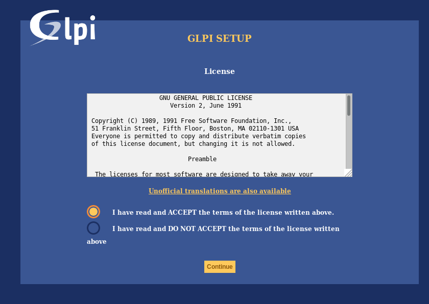
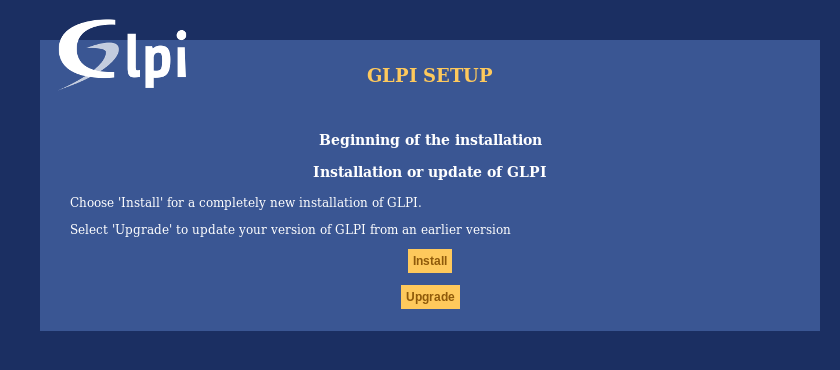
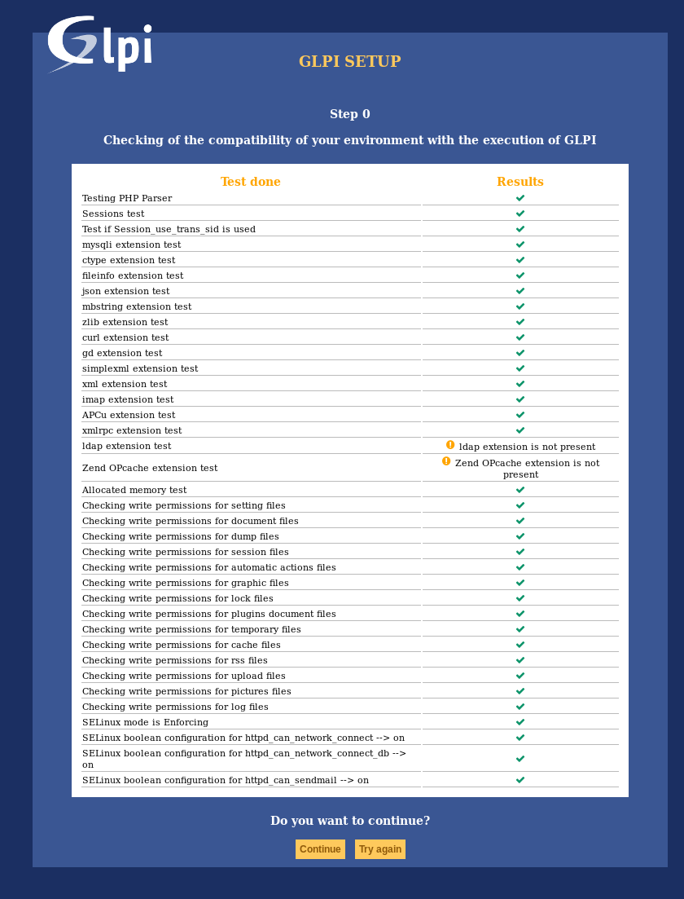
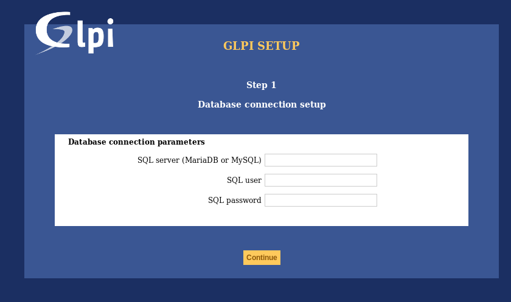
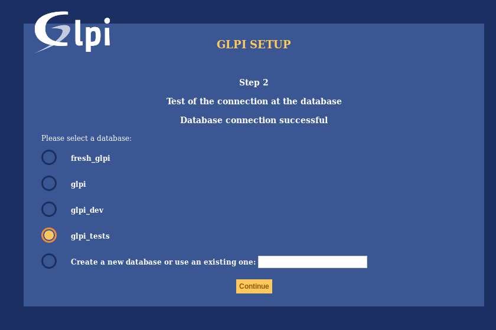
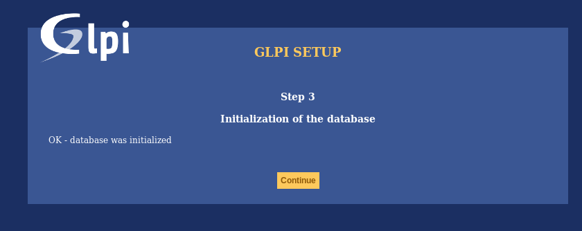
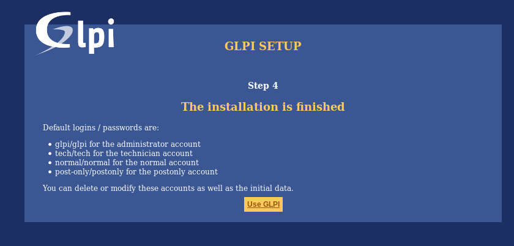

Install wizard
==============

To begin installation process, point your browser to the GLPI main address:
`https://{adresse_glpi}/ <https://{adresse_glpi}/>`_

When GLPI is not installed; a step-by-step installation process begins.

Choose lang (Select your language)
----------------------------------

The first step will let you choose the installation language. Select your lang, and click validate.


License
-------

Usage of GLPI is subject to GNU license approval. One licensing terms read an accepted, just validate the form.



If you do not agreee with licensing terms, it is not possible to continue installation process.

Install / Update
----------------

This screen allows to choose beetween a fresh GLPI installation or an update.



Click on install.

Environment checks
^^^^^^^^^^^^^^^^^^

This step will check if prerequisites are met. If thery're not, it is not possible to continue and an explicit error message will tell you about what is wonrg and what to do before trying again.



Some prerequisites are optionals, it will be possible to continue installation event if thery're not met.

Database connection
^^^^^^^^^^^^^^^^^^^

Database connection parameters are asked.



* *MySQL server*: enter the path to your MySQL server, `localhost` or `mysql.domaine.tld` as example;
* *MySQL user*: enter user name that is allowed to connect to the Database;
* *MySQL password*: enter user's password.

Once all fields are properly filled, validate the form.

A first database connection is then established. If parameters are invalid, an error message will be displayed, and you'll have to fix parameters and try again.
nouveau.

Database choice
^^^^^^^^^^^^^^^

Once connection to the database server is OK, you have to create or choose the database you want for your GLPI and init it.



There are 2 ways to go:

* use an existing database

   Select this database in the displayed list. Validate to use.

   .. warning::

      Selected database contents will be destroyed on installation.

* Create a new database

   Choose *Create a new database*, enter the database name in the relevant field and then validate to create the base.

   .. warning::

      SQL user must be able to create new database for this option to work.

Database initialization
^^^^^^^^^^^^^^^^^^^^^^^

This steps initializes the database with default values.



If there is any error; py attention to the displayed informations.

End of installation
^^^^^^^^^^^^^^^^^^^

This step presents a summary of the installation and give created users list. Please pay attention to those informations and validate to got to the app.



.. note::

   Default user accounts are:

   * *glpi/glpi* admin account,
   * *tech/tech* technical account,
   * *normal/normal* "normal" account,
   * *post-only/postonly* post-only account.

.. warning::

   For obvious security concerns, you'll have to delete or edit those accounts.

   Before removing the ```glpi`` account, please make sure you have created another user with ``super-admin`` profile.
